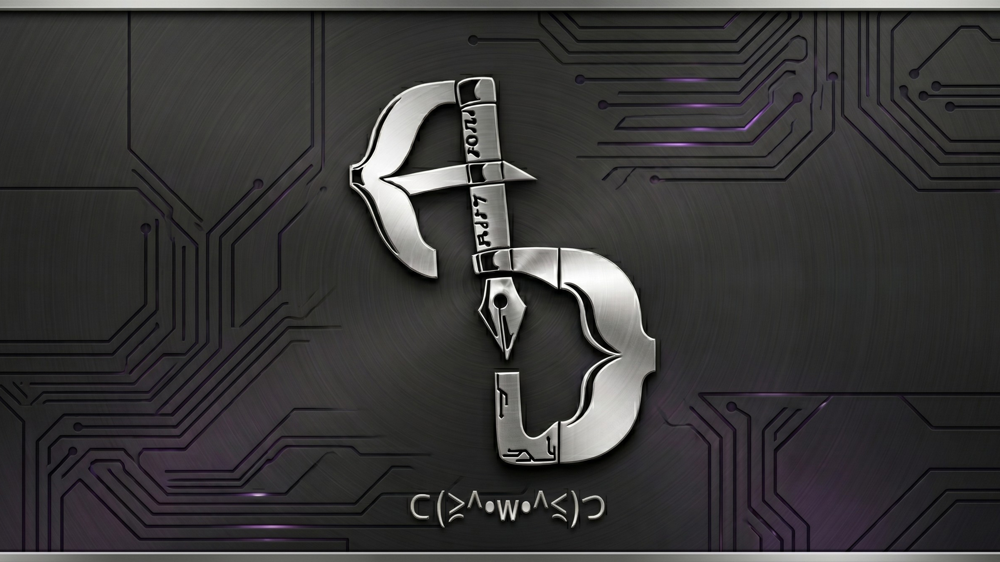
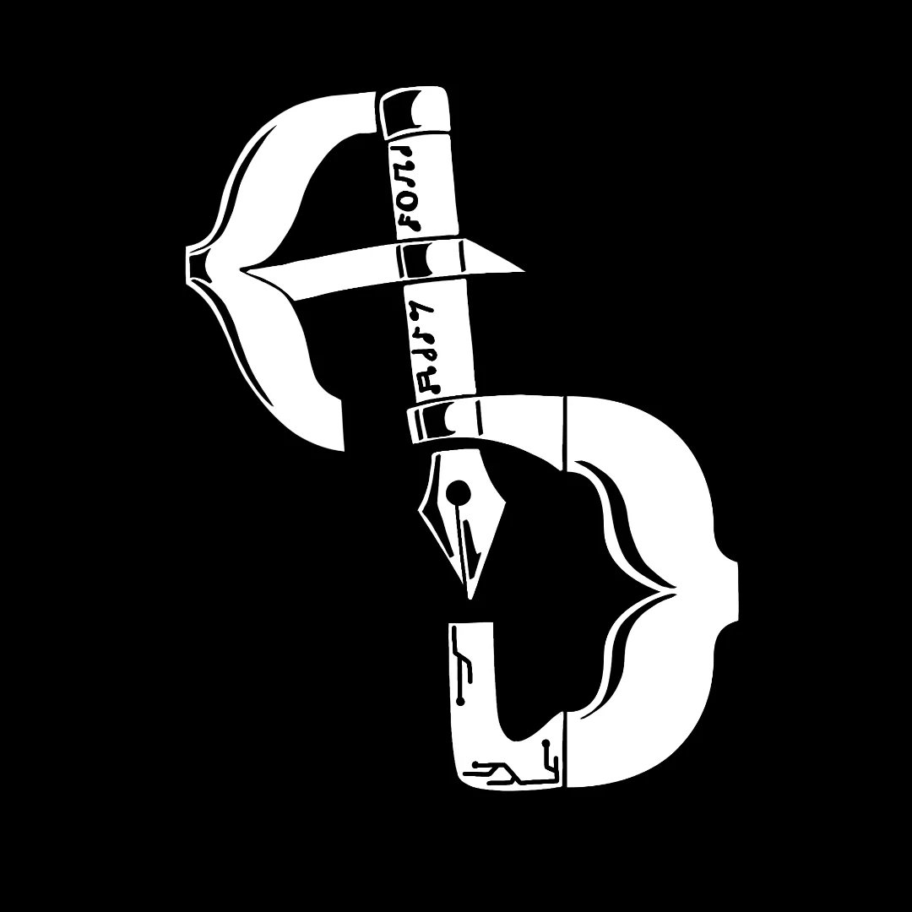
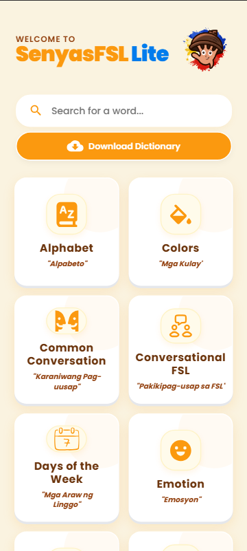
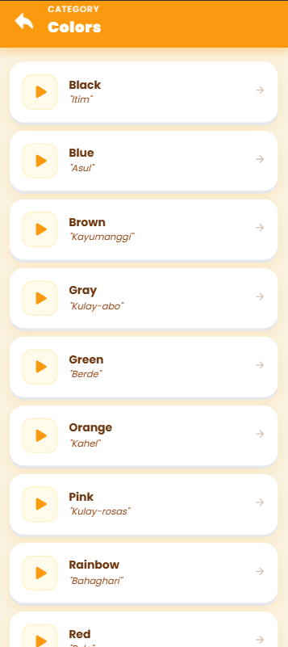
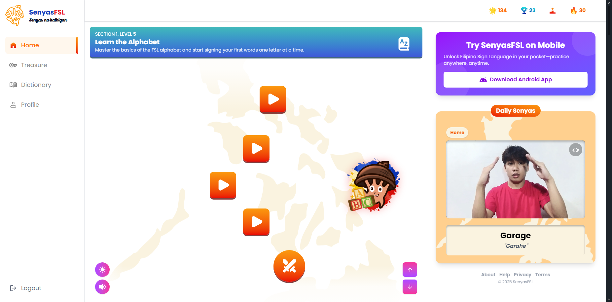
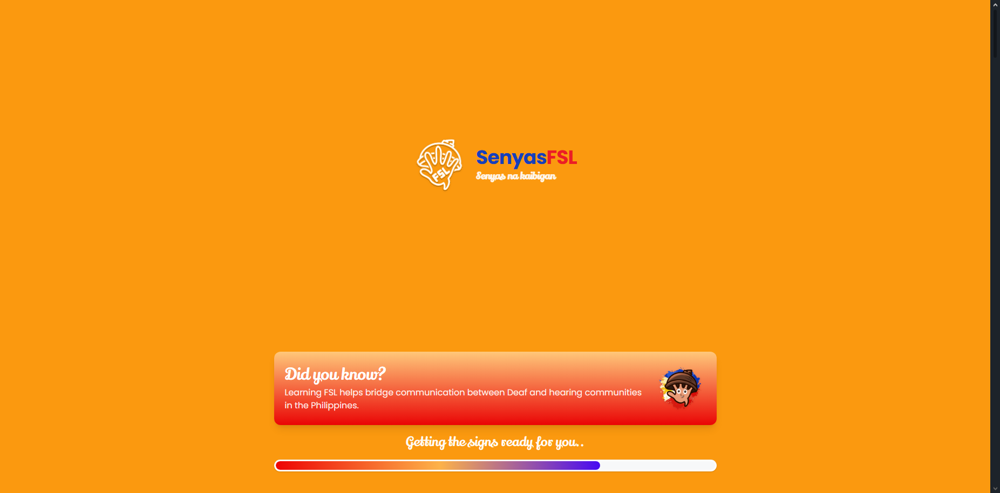
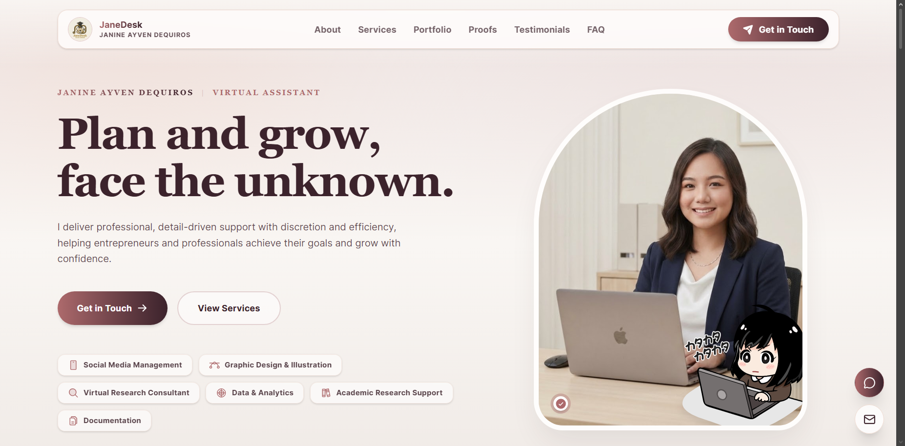
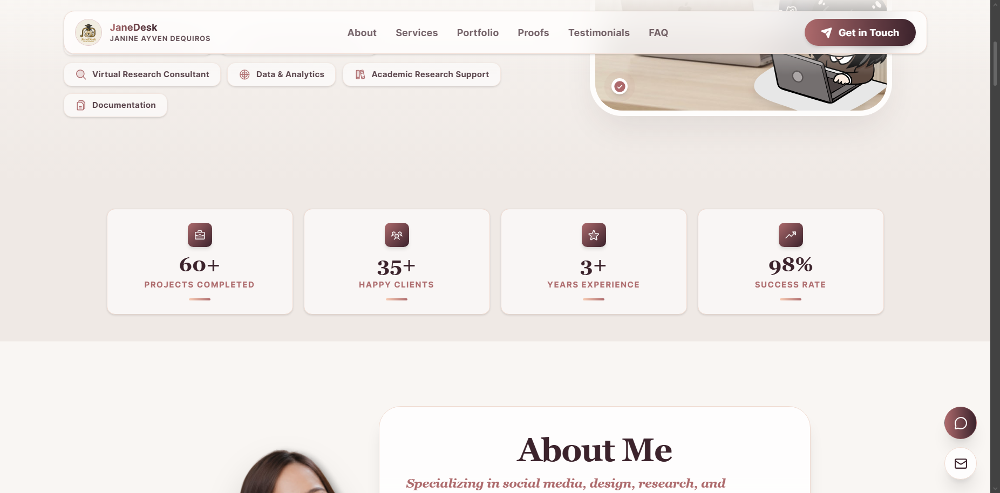

  

<table border="0" width="100%">
  <tr>
    <td width="20%" align="center">
      
    </td>
    <td width="80%">
      <h1>Allen Icee Dequiros ヾ(＾-＾)ノ</h1>
      <h3>Full-Stack Web & Mobile AI-Assisted Developer | Digital Artist</h3>
      
A passionate BSIT student continuously learning and building practical, user-focused systems to solve everyday problems for local communities.

      
      
      
    </td>
  </tr>
</table>

<h3>Languages & Tools (⌐■_■)</h3>

  
  
  
  
  
  
  
  
  
  

<h2>Project Showcase (o^▽^o)</h2>

<h3>Mobile Applications</h3>
<table border="0" width="100%">
  <tr>
    <td width="60%" valign="top">
      <strong>SenyasFSL-Lite</strong> 
      <em>Ionic Framework, React.js, Capacitor, Firebase</em>  
      <ul>
        <li>Built a lightweight version of SenyaFSL optimized for lower-end Android devices and limited-bandwidth environments.</li>
        <li>Implemented a searchable FSL dictionary and streamlined educational modules while minimizing application size and resource usage.</li>
        <li>Focused on mobile accessibility, responsive UI, and improved performance for broader user adoption.</li>
      </ul>
      
    </td>
    <td width="40%" align="center" valign="middle">
      
      
    </td>
  </tr>
  <tr>
    <td width="60%" valign="top">
      <strong>GG&G Inventory Management App</strong> 
      <em>React.js, TypeScript, SQLite, Tailwind CSS, Capacitor</em>  
      <ul>
        <li>Developed a cross-platform inventory management application for tracking stock levels, deliveries, and client orders across multiple locations.</li>
        <li>Implemented synchronized mobile and web interfaces with real-time Firestore database updates.</li>
        <li>Designed responsive dashboards and inventory workflows to reduce stock discrepancies and improve monitoring efficiency.</li>
      </ul>
      
    </td>
    <td width="40%" align="center" valign="middle">
      
      
    </td>
  </tr>
</table>

 

<h3>Full-Stack Web & Desktop Systems</h3>
<table border="0" width="100%">
  <tr>
    <td width="60%" valign="top">
      <strong>SenyaFSL: Gamified Filipino Sign Language Learning App</strong> 
      <em>React.js, TypeScript, Firebase, Tailwind CSS, DaisyUI, Capacitor, MediaPipe, TensorFlow</em>  
      <ul>
        <li>Developed a cross-platform Filipino Sign Language (FSL) learning application with gamified lessons, progressive levels, and achievement-based learning.</li>
        <li>Integrated gesture recognition using MediaPipe and TensorFlow to create interactive sign language gameplay and improve learning engagement.</li>
        <li>Built mobile-ready deployment using Capacitor with Firebase Authentication, Firestore, and Cloud Functions for scalable backend services.</li>
      </ul>
      
    </td>
    <td width="40%" align="center" valign="middle">
        
      
    </td>
  </tr>
  <tr>
    <td width="60%" valign="top">
      <strong>JaneDesk Website Portfolio</strong> 
      <em>React.js, TypeScript, Vite, Laravel, Tailwind CSS, PostgreSQL, Cypress, Supabase</em>  
      <ul>
        <li>Built a responsive full-stack portfolio platform to showcase projects, technical skills, and professional experience.</li>
        <li>Developed a monorepo architecture combining a React frontend with a Laravel-powered backend API.</li>
        <li>Implemented responsive UI design, optimized asset delivery, and integrated contact form functionality.</li>
      </ul>
      
    </td>
    <td width="40%" align="center" valign="middle">
        
      
    </td>
  </tr>
  <tr>
    <td width="60%" valign="top">
      <strong>Motorized Tricycle Operator's Permit (MTOP) System</strong> 
      <em>Laravel, React.js, TypeScript, Tailwind CSS, Electron.js, SQLite</em>  
      <ul>
        <li>Developed a municipal Motorized Tricycle Operator’s Permit (MTOP) management system to automate franchise applications, renewals, fee tracking, and permit generation.</li>
        <li>Built an Electron-based desktop client for municipal staff to manage OR records, payments, and operational workflows.</li>
        <li>Implemented synchronization workers, automated expiration alerts, and audit logging to improve regulatory compliance and data reliability.</li>
      </ul>
      
    </td>
    <td width="40%" align="center" valign="middle">
        
      
    </td>
  </tr>
  <tr>
    <td width="60%" valign="top">
      <strong>Stall Management System</strong> 
      <em>Laravel, Inertia.js, MySQL, RBAC, React.js, TypeScript, Tailwind CSS</em>  
      <ul>
        <li>Created a stall and tenant management system for municipal public markets, including building layouts, contracts, payments, and vendor records.</li>
        <li>Automated contract monitoring, penalty computation, and payment tracking to reduce manual administrative workload.</li>
        <li>Implemented role-based access control and Excel import utilities for efficient operational management.</li>
      </ul>
      
    </td>
    <td width="40%" align="center" valign="middle">
        
      
    </td>
  </tr>
  <tr>
    <td width="60%" valign="top">
      <strong>Municipal Library System</strong> 
      <em>Laravel, Inertia.js, MySQL, React.js, TypeScript, Tailwind CSS</em>  
      <ul>
        <li>Developed a digital library management system for automating book circulation, visitor logging, overdue monitoring, and patron management.</li>
        <li>Built a centralized public catalog and administrative dashboard to replace paper-based tracking processes.</li>
        <li>Added automated overdue notifications, report exports, and library card management features.</li>
      </ul>
      
    </td>
    <td width="40%" align="center" valign="middle">
        
      
    </td>
  </tr>
  <tr>
    <td width="60%" valign="top">
      <strong>Queuing System</strong> 
      <em>Laravel, Laravel Reverb, WebSockets, SQLite, React.js, TypeScript, Tailwind CSS</em>  
      <ul>
        <li>Built a real-time clinic queue management system with queue kiosks, digital displays, reporting modules, and department-based services.</li>
        <li>Integrated Laravel Reverb WebSockets for live queue broadcasting and synchronized display updates.</li>
        <li>Improved patient flow and operational efficiency through structured intake and queue monitoring features.</li>
      </ul>
      
    </td>
    <td width="40%" align="center" valign="middle">
        
      
    </td>
  </tr>
</table>

<h3>Certifications ヽ(•‿•)ノ</h3>
<ul>
  <li><strong>EF SET English Certificate 80/100 (C2 Proficient)</strong></li>
  <li><strong>Cisco Apply AI: Analyze Customer Reviews</strong></li>
  <li><strong>Cisco CCNA: Switching, Routing, and Wireless Essentials</strong></li>
  <li><strong>Cisco CCNA: Introduction to Networks</strong></li>
  <li><strong>Cisco JavaScript Essentials 1</strong></li>
</ul>

<h3 align="center">Let's Connect! (ﾉ◕ヮ◕)ﾉ*:･ﾟ✧</h3>

I am always open to discussing new projects, creative ideas, or opportunities.

  <a href="mailto:alleniceedequiros@gmail.com">Email Me</a> • 
  <a href="https://www.linkedin.com/in/allen-icee-dequiros">LinkedIn</a> • 
  <a href="https://mrdearest.vercel.app">Portfolio</a>

