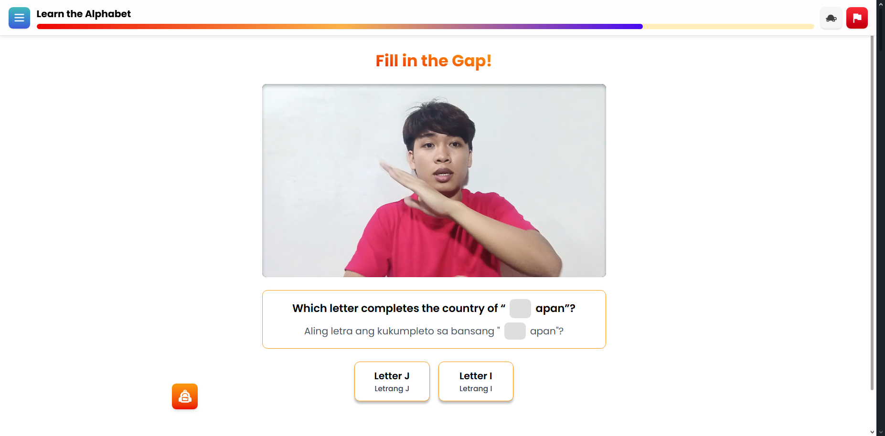
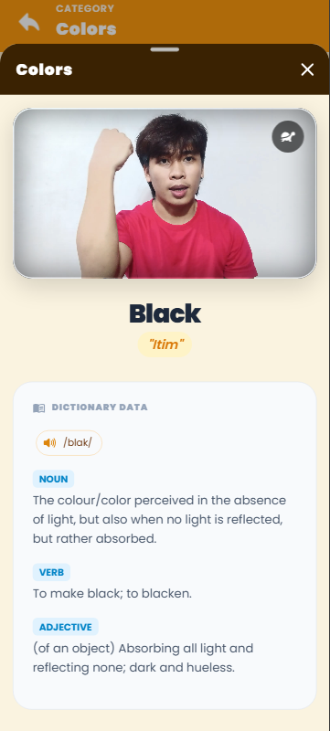

  

  
  <h1>Allen Icee Dequiros 👋</h1>
  <h3>Full-Stack Web & Mobile AI-Assisted Developer | Digital Artist</h3>
  
Building robust, real-time cross-platform systems for education, healthcare, and municipal operations.

  
  
  

<h3 align="center">🧰 Languages & Tools</h3>

  
  
  
  
  
  
  
  
  
  

<h2 align="center">💻 Project Showcase</h2>

### 📱 Mobile Applications

**1. SenyaFSL** | Gamified Filipino Sign Language Learning App
> *React.js, TypeScript, Firebase, Tailwind CSS, Capacitor, MediaPipe, TensorFlow*
 
  
 

  

**2. SenyasFSL-Lite** | Lightweight FSL Dictionary App
> *Ionic Framework, React.js, Capacitor, Firebase*
 
  
 

  

**3. GG&G Inventory Management App** | Cross-Platform Stock Tracking
> *React.js, TypeScript, SQLite, Tailwind CSS, Capacitor*
 
  
 

### 🌐 Full-Stack Web & Desktop Systems

**1. JaneDesk Website Portfolio** | Full-Stack Monorepo
> *React.js, TypeScript, Vite, Laravel, PostgreSQL, Cypress, Supabase*
 
 
 

  

**2. Motorized Tricycle Operator's Permit (MTOP) System** | LGU Management
> *Laravel, React.js, TypeScript, Tailwind CSS, Electron.js, SQLite*
 
 
 

  

**3. Stall Management System** | Public Market Administration
> *Laravel, Inertia.js, MySQL, RBAC, React.js, TypeScript*
 
 
 

  

**4. Municipal Library System** | Digital Circulation
> *Laravel, Inertia.js, MySQL, React.js, TypeScript*
 
 
 

  

**5. Real-Time Queuing System** | Clinic Flow Management
> *Laravel, Laravel Reverb, WebSockets, SQLite, React.js, TypeScript*
 
 
 

<h3 align="center">📊 GitHub Analytics</h3>

  

